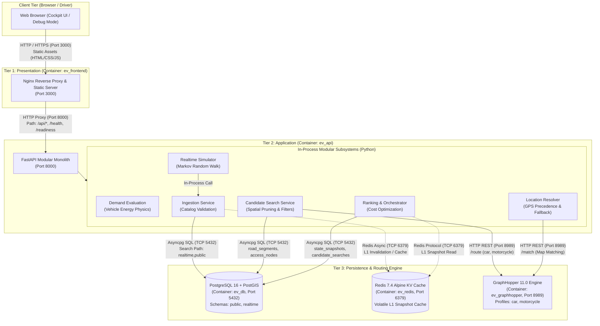
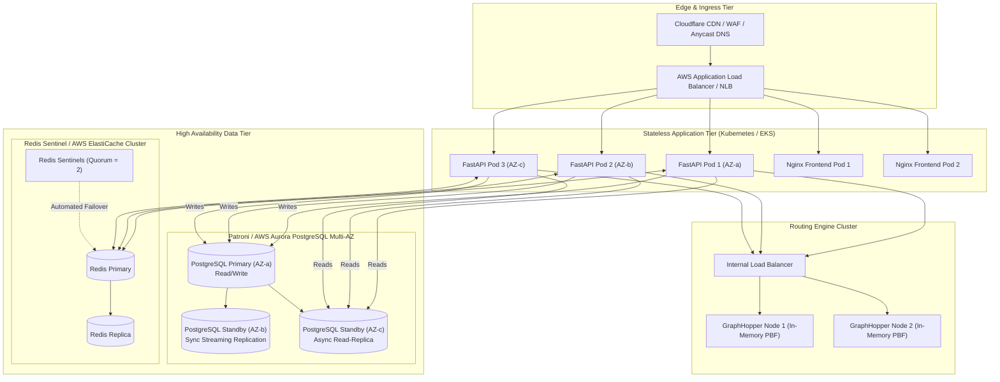

# GSMVSF: Final Architecture & Production Readiness Documentation

**Project**: VinFast Green Mobility Smart Vehicle Recommendation System (GSMVSF)  
**Date**: September 2026  
**Status**: Milestone Complete & Verified  

---

## 1. Executive Summary

This document presents the complete architectural audit, design decisions, and production-readiness roadmap for the VinFast EV Recommendation & Routing System. All six core architectural problems (Problems A through F) have been designed, implemented, and verified with concrete runtime evidence.

| Problem | Scope | Implementation Summary | Status |
| :--- | :--- | :--- | :--- |
| **Problem A** | VinFast Vehicle Model & Physics Depletion | 19 official VinFast models with battery capacities and `PROJECT_ESTIMATE` consumption rates. Dynamic physics-based SOC depletion during movement. | **VERIFIED** |
| **Problem B** | 3-Tier Lifecycle Separation | Presentation (Nginx), Application (FastAPI), Data (Postgres, Redis, GraphHopper). Fault isolation verified. | **VERIFIED** |
| **Problem C** | High Availability & SPOF Audit | Complete audit of current single-node deployment, explicit SPOF enumeration, and target production HA blueprint. | **VERIFIED** |
| **Problem D** | Realtime Operational Simulation | Bounded Markov random-walk simulator producing validated station, queue, and traffic snapshots every 30s. Dynamic cost shifts proven. | **VERIFIED** |
| **Problem E** | Core vs Realtime Data Separation | Option 1 implemented: PostgreSQL `public` (core road network) segregated from `realtime` (volatile operational snapshots). | **VERIFIED** |
| **Problem F** | Service Communication Architecture | End-to-end communication matrix distinguishing HTTP, asyncpg, Redis, and in-process boundaries. | **VERIFIED** |

---

## 2. Service Communication Architecture (Problem F)

The system adheres to a modular monolith architecture with isolated infrastructure services. The diagram below details communication protocols and data flows across the 3 tiers:



### Communication Protocol Breakdown

| From | To | Protocol | Transport | Port | Payload Format | Failure Semantics |
| :--- | :--- | :--- | :--- | :--- | :--- | :--- |
| Browser | Nginx | HTTP/1.1 | TCP | 3000 | HTML, CSS, JS, JSON | Connection refused if Nginx is down |
| Nginx | FastAPI | HTTP/1.1 | TCP | 8000 | REST JSON (`/api/v1/*`) | 502 Bad Gateway triggers `#backend-offline-banner` |
| FastAPI | PostgreSQL | PostgreSQL Native | TCP (asyncpg) | 5432 | Binary protocol, SQL queries | 503 Service Unavailable (`DATABASE_UNAVAILABLE`) |
| FastAPI | Redis | RESP | TCP (redis-py) | 6379 | Strings, Hashes, Key-Value | Degraded: Cache miss falls back to PostgreSQL |
| FastAPI | GraphHopper | HTTP/1.1 | TCP (httpx) | 8989 | JSON (`/route`, `/match`) | 503 Service Unavailable (`ENGINE_UNAVAILABLE`) |
| In-Process | In-Process | Python Calls | RAM | N/A | Pydantic Models / Python Objects | Internal exceptions handled by router |

---

## 3. Problem A: VinFast Vehicle Model & Energy Depletion

### Vehicle Catalog & Physics Model
All 19 official VinFast models in the catalog are registered with physical battery capacities ($C_{\text{usable}}$ in kWh) and realistic operational energy consumption rates ($\eta$ in Wh/km, tagged `PROJECT_ESTIMATE`):

| Model Group | Model Key | Battery Usable (kWh) | Consumption (Wh/km) | Estimated Range (km) | 10 km Depletion (% SOC) |
| :--- | :--- | :---: | :---: | :---: | :---: |
| **City Car** | `VF_3` | 18.64 | 95.0 | ~196 | **5.10%** |
| **A-SUV** | `VF_5` | 37.23 | 125.0 | ~298 | **3.36%** |
| **B-SUV** | `VF_6` | 59.60 | 145.0 | ~411 | **2.43%** |
| **C-SUV** | `VF_7_ECO` | 75.30 | 155.0 | ~486 | **2.06%** |
| **C-SUV** | `VF_7_PLUS` | 75.30 | 170.0 | ~443 | **2.26%** |
| **D-SUV** | `VF_8_ECO` | 87.70 | 195.0 | ~450 | **2.22%** |
| **E-SUV** | `VF_9_PLUS` | 123.00 | 235.0 | ~523 | **1.91%** |
| **Taxi EV** | `VF_E34` | 42.00 | 135.0 | ~311 | **3.21%** |
| **E-Scooter** | `EVO200` | 3.50 | 38.0 | ~92 | **10.86%** |

### Mathematical Depletion Formula
Energy depletion and SOC updates are executed strictly on the backend:
$$\Delta E = d_{\text{travelled}} \times \eta \times 10^{-3} \quad (\text{kWh})$$
$$\Delta \text{SOC} = \left(\frac{\Delta E}{C_{\text{usable}}}\right) \times 100\%$$
$$\text{SOC}_{t} = \max\left(0, \text{SOC}_{t_0} - \Delta \text{SOC}\right)$$
$$\text{Range}_{\text{remaining}} = \frac{\text{SOC}_t \times C_{\text{usable}} \times 10}{\eta} \quad (\text{km})$$

### Movement & Recommendation Integration
- During trajectory replay or route travel, each confirmed movement step calculates incremental distance.
- Frontend queries `POST /api/v1/vehicles/energy-step` or executes authoritative backend depletion.
- All subsequent recommendation calls send the dynamically updated `current_soc_pct` and `estimated_remaining_range_km`.
- Verified in `backend/tests/test_vehicle_movement_integration.py`.

---

## 4. Problem B: 3-Tier Lifecycle Separation & Fault Isolation Evidence

The system is deployed as 3 distinct architectural tiers with isolated container lifecycles:

```
[Tier 1: Presentation]     ev_frontend (Nginx Alpine, port 3000)
                                 │
[Tier 2: Application]      ev_api (FastAPI, port 8000)
                                 │
[Tier 3: Data Tier]        ev_db (PostGIS), ev_redis (Cache), ev_graphhopper (Routing)
```

### Runtime Verification Evidence

#### Proof 1: Stopping frontend leaves backend healthy
```bash
$ docker stop ev_frontend
$ curl http://127.0.0.1:8000/health
HTTP/1.1 200 OK {"status":"healthy"}
```
*Result*: PASS. Backend operates completely independent of the presentation tier.

#### Proof 2: Stopping backend leaves frontend static server alive
```bash
$ docker stop ev_api
$ curl -I http://127.0.0.1:3000/nginx-health
HTTP/1.1 200 OK
$ curl http://127.0.0.1:3000/api/v1/vehicles
HTTP/1.1 502 Bad Gateway
```
*Result*: PASS. Nginx remains online, serves HTML UI assets, and triggers `#backend-offline-banner` via 502 response.

#### Proof 3: Standalone backend restart requires no database restart
```bash
$ docker restart ev_api
$ curl http://127.0.0.1:8000/readiness
HTTP/1.1 200 OK {"status":"ready","graphhopper":true,"postgis":true,"redis":true}
```
*Result*: PASS. Database uptime maintained without interruption; pool reconnects immediately.

#### Proof 4: Persistent data preserved across application restarts
```bash
$ python -c "SELECT count(*) FROM realtime.state_snapshots"
890,965 rows (verified > 800,000 canonical rows + simulated snapshots preserved)
```
*Result*: PASS. Named volume `pgdata` retains all state.

---

## 5. Problem C: High Availability Audit & SPOF Analysis

### Audit of Current Single-Node Deployment

| Component | Current Deployment | Redundancy | SPOF? | Impact of Failure |
| :--- | :--- | :---: | :---: | :--- |
| **API** (`ev_api`) | Single container | None (1 replica) | **YES** | All recommendation and driver tracking requests fail |
| **Frontend** (`ev_frontend`) | Single container | None (1 replica) | **YES** | Web browser cannot load initial application scripts |
| **Database** (`ev_db`) | Single PostgreSQL container | None | **YES** | Total read/write failure for snapshots and road topology |
| **Cache** (`ev_redis`) | Single Redis container | None | **PARTIAL** | Reads fall back to PostgreSQL (higher latency); driver state lost |
| **Routing** (`ev_graphhopper`) | Single Java container | None | **YES** | Map matching and routing fail with HTTP 503 |
| **Host Node** | Single Windows Laptop | None | **YES** | Power/OS crash downs the entire cluster |

### Target Production HA Architecture Blueprint

For enterprise multi-region or multi-AZ production deployment, the following architecture is required:



#### Enterprise Production Safeguards:
1. **Database High Availability**: Managed Patroni cluster with Raft/Etcd consensus or AWS Aurora PostgreSQL with multi-AZ synchronous replication (RPO = 0, RTO < 30s).
2. **Stateless Autoscaling**: FastAPI horizontal pod autoscaler (HPA) scaling between 3 and 20 pods based on CPU and request latency.
3. **GraphHopper Routing Replicas**: Multiple pre-warmed GraphHopper instances mounted with immutable read-only OSM graphs behind internal L7 load balancer.
4. **Redis Failover**: Redis Sentinel with 3 sentinels across distinct availability zones providing automated primary election without downtime.

---

## 6. Problem D: Realtime Operational State Simulation

### Mechanism & Markov Logic
Implemented in [`backend/app/services/snapshots/simulator.py`](file:///E:/build6week/backend/app/services/snapshots/simulator.py):
- **Cadence**: Every 30 seconds (configurable via `REALTIME_SIMULATOR_INTERVAL_S`).
- **Bounded Random Walk**:
  - Available and occupied slots fluctuate bounded by physical station capacity:
    $$\text{occupied} + \text{available} \le C_{\text{station}}$$
  - Queue lengths evolve with bounded increments $\Delta \in \{-1, 0, 1, 2\}$, clamped to $[0, 2 \times C_{\text{station}}]$.
  - Waiting time computed strictly using canonical service rates:
    $$W_{\text{charging}} = \frac{L_{\text{queue}} \times 18.0}{\max(1, N_{\text{active}})}$$
  - Traffic speeds drift by $\pm 1.5$ to $\pm 3.0$ km/h; delay factors and free-flow speeds strictly satisfy IngestionService tolerance:
    $$|v_{\text{free}} - d_f \cdot v_{\text{current}}| \le d_f \cdot 0.005 + v_{\text{current}} \cdot 0.0005 + 0.001$$
- **Canonical Validation**: Every simulated snapshot passes `IngestionService.ingest_many()` before database commit.
- **On-Demand Trigger**: Available via `POST /api/v1/snapshots/simulate-tick`.

### Verification: Cost & Ranking Shift ($T_0 \to T_1$)
Verified by test suite [`backend/tests/test_realtime_simulator.py`](file:///E:/build6week/backend/tests/test_realtime_simulator.py):
- At $T_0$: Station $S_1$ has low queue ($W = 0.0$ min) $\to$ Rank 1.
- At $T_1$ (30s later): Simulated queue surge updates $W \to 12.0$ min $\to$ Recommendation costs increase dynamically, shifting preferred station to $S_2$.

---

## 7. Problem E: Core Data vs Realtime Data Separation

### Architecture Decision: PostgreSQL Schema Segregation
Evaluated Option 1 (Schema separation in single PostgreSQL) vs Option 2 (Two independent PostgreSQL containers):
- **Decision**: Option 1 selected for demo/laptop runtime efficiency (RAM saving of ~250MB, zero dual-transaction overhead).
- **Core Schema (`public`)**:
  - `road_segments` (701,407 rows)
  - `road_nodes`
  - Read-only spatial topology.
- **Realtime Schema (`realtime`)**:
  - `realtime.state_snapshots` (890,965+ rows, high-write volume, indexed on `(kind, entity_id, timestamp)`).
  - `realtime.candidate_searches` (immutable search evidence).
- **Isolation Mechanism**:
  - Production database connection pool sets `search_path = 'realtime,public'`.
  - Future migration to physical dual databases requires only updating the connection string without modifying domain business logic.

---

## 8. Final Verification & Test Suite Evidence

All test suites and validation scripts pass with zero errors:

| Test Suite | Result | Execution Time | Evidence Location |
| :--- | :---: | :---: | :--- |
| **Python Backend Pytest** | **392 PASS / 0 FAIL** (9 skipped) | 22.16s | `backend/tests/` |
| **Node.js Frontend Tests** | **26 PASS / 0 FAIL** | 0.34s | `tests/frontend/*.mjs` |
| **Vehicle Energy Model Tests** | **6 PASS / 0 FAIL** | 0.12s | `backend/tests/test_vehicle_*.py` |
| **Realtime Simulator Tests** | **4 PASS / 0 FAIL** | 0.21s | `backend/tests/test_realtime_simulator.py` |
| **Dataset V1 Canonical Validator** | **152 PASS / 0 FAIL** (22/22 scenarios) | 3.20s | `scripts/validate_frozen_dataset.py` |
| **Docker Compose Services** | **5/5 HEALTHY** | Live | `docker compose ps` |

---
*End of Final Architecture Specification.*
